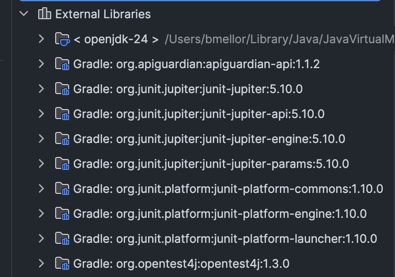

# Astronomical Physics Calculator

A Java-based physics n-body problem simulation programme  that models gravitational interactions between celestial bodies (planets and stars) in 3D coordinate space.

## Installing/Running the application
There are two ways to run the app you can either run `Main.java` or run the tests in the test folder using JUnit.

### Usage

#### Running Preset Simulations
After running `Main.java` you can choose from preset options:
- **Option 1**: Sun and Earth (two-body system, 1 year simulation)
- **Option 2**: Sun, Earth, and Mars (three-body system, 1 year simulation)
- **Option 3**: Custom N-body simulation (input your own values)

Link to GitHub [Repo](https://github.com/mellor17/physicsCalculator)
###### **NOTE:** This was developed using IntelliJ IDEA and on OpenJDK 24, if you have issues running the code, please let me know.
